# Documentação Técnica Completa - Ecossistema DocuIA

Data da análise: 25/05/2026

## Sumário
- [1. Visão Geral do Projeto](#1-visão-geral-do-projeto)
- [2. Visão Geral da Arquitetura](#2-visão-geral-da-arquitetura)
- [3. Estrutura do Projeto](#3-estrutura-do-projeto)
- [4. Tecnologias Utilizadas](#4-tecnologias-utilizadas)
- [5. Detalhes de Implementação](#5-detalhes-de-implementação)
- [6. Banco de Dados](#6-banco-de-dados)
- [7. APIs e Endpoints](#7-apis-e-endpoints)
- [8. Interface Web (Frontend)](#8-interface-web-frontend)
- [9. Fluxos do Sistema](#9-fluxos-do-sistema)
- [10. Diagramas de Classes](#10-diagramas-de-classes)
- [11. Instalação e Execução](#11-instalação-e-execução)
- [12. Repositórios Relacionados](#12-repositórios-relacionados)
- [13. Decisões Técnicas e Trade-offs](#13-decisões-técnicas-e-trade-offs)
- [14. Problemas e Soluções](#14-problemas-e-soluções)
- [15. Conclusão](#15-conclusão)

---

## 1. Visão Geral do Projeto

O DocuIA é um sistema web orientado a microserviços para gestão de usuários, empresas e projetos, com foco em colaboração e permissões por contexto.

### Objetivos funcionais identificados
- Cadastro, login e gestão de perfil de usuário.
- Criação e administração de empresas.
- Criação e administração de projetos vinculados a empresas.
- Gestão de membros, roles e solicitações de acesso.
- Registro de acessos recentes para dashboards.
- Navegação web baseada em páginas server-rendered (Jinja2) e consumo de APIs REST.

### Escopo técnico real encontrado
- 4 repositórios independentes.
- Backend em FastAPI com SQLAlchemy e PostgreSQL.
- Frontend em FastAPI + Jinja2 + JavaScript vanilla.
- Deploy automatizado para Azure Web App via GitHub Actions.

---

## 2. Visão Geral da Arquitetura

### 2.1 Arquitetura utilizada

Arquitetura distribuída em **4 serviços**:
- `MS1`: autenticação/perfil (`docuia-auth`)
- `MS2`: empresas/membros/solicitações/papéis (`docuia-empresas`)
- `MS3`: projetos/membros/solicitações (`docuia-projetos`)
- `Frontend`: entrega de páginas HTML + assets + JS (`docuia-frontend`)

Nos backends, o padrão dominante é **Clean Architecture / Ports & Adapters (Hexagonal simplificada)**:
- `domain`: entidades e contratos (ports)
- `application`: casos de uso
- `infrastructure`: banco e implementações de repositório
- `presentation`: controllers/routers FastAPI

### 2.2 Organização em camadas

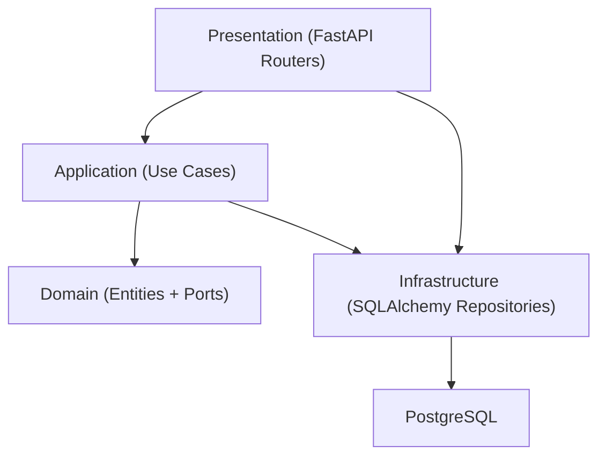

### 2.3 Separação frontend/backend
- Frontend não contém regra de negócio crítica de domínio; atua como cliente das APIs.
- Backends concentram autenticação, autorização, regras de permissão, persistência e validações principais.

### 2.4 Fluxo geral do sistema

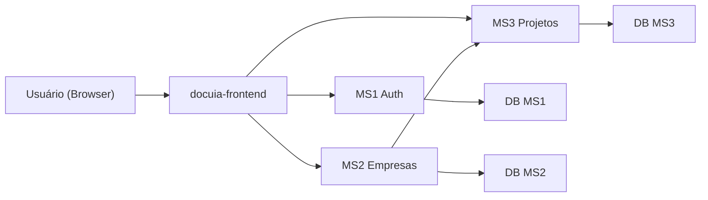

### 2.5 Comunicação entre serviços
- Frontend → Backends via `fetch`.
- `MS2` (empresas) chama `MS3` (projetos) para ocultação em cascata ao excluir empresa:
  - `DELETE /projetos/empresa/{empresa_id}/ocultar` (best effort).

### 2.6 Padrões de projeto identificados
- Repository Pattern (interfaces de porta + implementações SQLAlchemy).
- Use Case Pattern (regras encapsuladas por ação de negócio).
- DTOs/Schemas via Pydantic nas bordas de API.
- Soft delete por `status` em empresa/projeto.
- Token-based auth (JWT Bearer).

### 2.7 Justificativas técnicas inferidas
- Separação por microserviços reduz acoplamento entre domínios.
- Uso de ports permite trocar infraestrutura sem alterar regras de negócio.
- JWT simplifica autenticação stateless entre frontend e APIs.
- Soft delete evita perda imediata de dados operacionais.

---

## 3. Estrutura do Projeto

## 3.1 Mapa de repositórios

```text
GitHub/
笏懌楳笏€ docuia-auth/
笏懌楳笏€ docuia-empresas/
笏懌楳笏€ docuia-projetos/
笏懌楳笏€ docuia-frontend/
```

### 3.2 `docuia-auth` (MS1)

#### Pastas principais
- `domain/entities/usuario.py`: entidade `Usuario`.
- `domain/ports/usuario_repository.py`: contrato `IUsuarioRepository`.
- `application/use_cases/auth_use_cases.py`: login, cadastro, recuperação, redefinição, edição de perfil, troca de senha.
- `infrastructure/database/models.py`: tabela `usuarios`.
- `infrastructure/database/usuario_repository_impl.py`: adaptação entidade/modelo.
- `presentation/api/auth_router.py`: rotas de autenticação.
- `presentation/api/perfil_router.py`: rotas de perfil e batch de usuários.
- `main.py`: bootstrap FastAPI, CORS, health checks.

#### Responsabilidades e dependências
- Depende de `passlib` para hash de senha, `python-jose` para JWT e `sqlalchemy` para persistência.
- Não depende dos outros microserviços diretamente.

### 3.3 `docuia-empresas` (MS2)

#### Pastas principais
- `domain/entities/empresa.py`: entidades `Empresa`, `Membro`, `Solicitacao`, `Papel`.
- `domain/ports/empresa_repository.py`: contratos de repositório.
- `application/use_cases/empresa_use_cases.py`: regras de negócio de empresas e membros.
- `infrastructure/database/models.py`: tabelas `empresas`, `membros`, `solicitacoes`, `papeis`, `acessos_empresa`.
- `infrastructure/database/empresa_repository_impl.py`: implementações SQLAlchemy.
- `presentation/api/empresa_router.py`: endpoints REST.
- `main.py`: app, CORS, health, ajuste de schema.

#### Responsabilidades e dependências
- Gestão de empresas e papéis.
- Controle de permissões owner/admin/member.
- Chama `MS3` para ocultar projetos vinculados na exclusão de empresa.

### 3.4 `docuia-projetos` (MS3)

#### Pastas principais
- `domain/entities/projeto.py`: entidades `Projeto`, `MembroProjeto`, `SolicitacaoProjeto`.
- `domain/ports/projeto_repository.py`: contratos de repositório.
- `application/use_cases/projeto_use_cases.py`: casos de uso de projeto.
- `infrastructure/database/models.py`: tabelas `projetos`, `membros_projeto`, `solicitacoes_projeto`, `acessos_projeto`.
- `infrastructure/database/projeto_repository_impl.py`: implementação concreta.
- `presentation/api/projeto_router.py`: rotas de projetos.
- `main.py`: app, CORS, health, ajuste de schema.

#### Responsabilidades e dependências
- Gestão de ciclo de vida do projeto (criar, editar, arquivar, excluir lógico).
- Gestão de membros e solicitações de acesso.

### 3.5 `docuia-frontend`

#### Estrutura principal
- `main.py`: servidor FastAPI para páginas.
- `templates/*.html`: páginas do sistema.
- `templates/partials/sidebar.html`: navegação lateral reutilizável.
- `static/js/api.js`: cliente HTTP central.
- `static/js/auth-guard.js`: proteção de páginas autenticadas.
- `static/css/*.css`: estilo global e sidebar.

#### Responsabilidades
- Renderizar interface.
- Consumir APIs dos microserviços.
- Armazenar token e dados básicos do usuário no `localStorage`.

---

## 4. Tecnologias Utilizadas

| Tecnologia | Finalidade | Onde é utilizada | Motivo da escolha (inferido) |
|---|---|---|---|
| Python 3.11 | Linguagem principal | Todos os repositórios | Ecossistema maduro para APIs |
| FastAPI | APIs REST e servidor frontend | Todos os repositórios | Produtividade e tipagem |
| Uvicorn | Servidor ASGI | Todos os serviços | Execução eficiente do FastAPI |
| SQLAlchemy 2.x | ORM/persistência | `auth`, `empresas`, `projetos` | Camada de abstração de DB |
| psycopg2-binary | Driver PostgreSQL | `auth`, `empresas`, `projetos` | Conector PostgreSQL padrão |
| Pydantic v2 | Validação de entrada/saída | Routers de backend | Contratos de payload |
| passlib | Hash de senha | `auth` | Segurança de credenciais |
| python-jose | JWT encode/decode | `auth`, `empresas`, `projetos` | Autenticação stateless |
| python-dotenv | Carregar `.env` | Todos | Configuração por ambiente |
| Jinja2 | Templates HTML | `frontend` | SSR simples com Python |
| JavaScript vanilla | Lógica de UI e chamadas API | `frontend/static/js` | Baixa complexidade e sem bundler |
| GitHub Actions | CI/CD | `.github/workflows` | Deploy automatizado |
| Azure Web Apps | Hospedagem | Todos os serviços | Deploy contínuo gerenciado |

### 4.1 Infraestrutura/Cloud
- Cada repositório possui workflow de build/deploy para um Web App específico.
- Uso de `azure/login@v2` e `azure/webapps-deploy@v3`.

### 4.2 Autenticação
- JWT assinado com `HS256`.
- Secret configurado por `JWT_SECRET`.
- Header esperado: `Authorization: Bearer <token>`.

### 4.3 Containers
- **Não há Dockerfile nem docker-compose** no código atual.
- Execução local é baseada em venv + uvicorn.

### 4.4 CI/CD
- Workflow em cada repo dispara em `push` na branch `main`.
- Pipeline:
  1. checkout
  2. setup Python 3.11
  3. instala dependências
  4. publica artifact
  5. deploy no Azure Web App

---

## 5. Detalhes de Implementação

### 5.1 Lógica principal do sistema
- Usuário autentica no `MS1`.
- Frontend guarda token e o anexa em chamadas autenticadas.
- Empresas e projetos usam o `sub` do JWT como identificador do usuário.
- Regras de acesso são validadas em use cases (owner/admin/member).

### 5.2 Autenticação e geração de tokens
- Login valida email + senha (hash) e gera JWT com `sub`, `email`, `nome`, `exp`.
- Recuperação de senha gera JWT de curta duração com `tipo=recuperar_senha`.

Exemplo real (resumo do código):

```python
payload = {
    "sub": str(usuario.id),
    "email": usuario.email,
    "nome": usuario.nome,
    "exp": datetime.utcnow() + timedelta(hours=JWT_EXPIRY_HOURS)
}
token = jwt.encode(payload, JWT_SECRET, algorithm="HS256")
```

### 5.3 Autorização
- Decodificação de JWT em `get_usuario_id` nos MS2 e MS3.
- Validações de permissão por contexto:
  - editar/excluir empresa: owner/admin (com restrições adicionais).
  - editar/arquivar projeto: owner/admin.
  - excluir projeto: owner.

### 5.4 Fluxo de dados

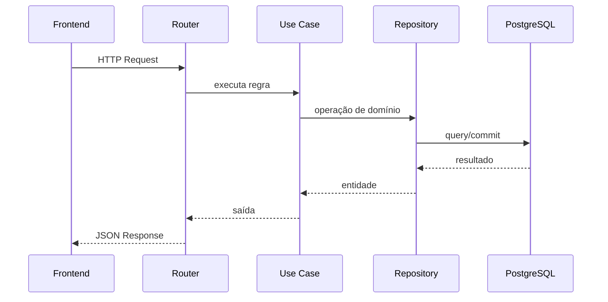

### 5.5 Persistência
- `Base.metadata.create_all(bind=engine)` em startup.
- Ausência de Alembic/migrations versionadas.
- Ajuste incremental manual de schema:
  - `MS2`: garante coluna `mensagem` em `solicitacoes`.
  - `MS3`: garante coluna `mensagem` em `solicitacoes_projeto`.

### 5.6 Gerenciamento de estado
- Estado de sessão no browser via `localStorage`:
  - `token`
  - `userData`
  - `user_id`
- Também há cache local de preferências (ex.: empresas fixadas, cores).

### 5.7 Validações
- Pydantic valida payloads básicos.
- Regras de negócio e permissões em use cases.
- Tratamento de erros converte exceções em `HTTPException`.

### 5.8 Upload de arquivos e integrações externas
- Não existe microserviço de upload neste workspace.
- Frontend prepara redirecionamento com token para serviços externos:
  - `UPLOAD_FRONTEND_URL`
  - `DIAGRAMAS_FRONTEND_URL`
  - `RELATORIOS_FRONTEND_URL`

### 5.9 Segurança
- Hash de senha com `pbkdf2_sha256` (com fallback `bcrypt`).
- JWT com expiração configurável.
- CORS restrito ao frontend Azure + localhost.
- Uso de resposta genérica no fluxo de “esqueci senha” para não revelar existência de email.

### 5.10 Tratamento de erros
- Erros de domínio lançados como `ValueError`/`PermissionError`.
- Conversão para HTTP 400/401/403/404 em routers.
- Em integrações internas (MS2 → MS3), falha é `best effort` (não bloqueia exclusão da empresa).

---

## 6. Banco de Dados

### 6.1 Visão geral
- 3 bancos PostgreSQL independentes (um por microserviço).
- Não há chaves estrangeiras cruzando microserviços.
- Integridade inter-serviço é lógica (via API), não relacional.

### 6.2 MS1 (`ms1_db`) - Autenticação

#### Tabela `usuarios`
- `id` (PK, int)
- `nome` (varchar255, not null)
- `email` (varchar255, unique, indexed, not null)
- `senha_hash` (varchar255, not null)
- `cargo` (varchar255, default "")
- `criado_em` (datetime)

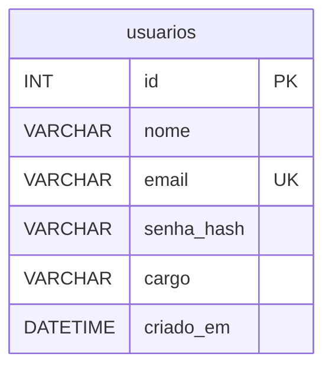

### 6.3 MS2 (`ms2_db`) - Empresas

#### Tabela `empresas`
- `id` PK
- `nome`
- `descricao`
- `cor`
- `dono_id` (referência lógica ao usuário do MS1)
- `status` (`ativo`/`arquivado`)
- `criado_em`

#### Tabela `membros`
- `id` PK
- `empresa_id` FK -> `empresas.id`
- `usuario_id` (referência lógica MS1)
- `role` (`owner`/`admin`/`member`)
- `criado_em`

#### Tabela `solicitacoes`
- `id` PK
- `empresa_id` FK -> `empresas.id`
- `usuario_id`
- `mensagem` (nullable)
- `status` (`pendente`/`aprovada`/`recusada`)
- `criado_em`

#### Tabela `papeis`
- `id` PK
- `empresa_id` FK -> `empresas.id`
- `nome`
- `descricao`
- `permissoes` (string CSV)

#### Tabela `acessos_empresa`
- `id` PK
- `empresa_id` FK -> `empresas.id`
- `usuario_id` (index)
- `ultimo_acesso_em`

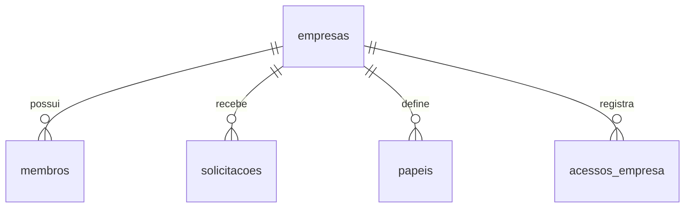

### 6.4 MS3 (`ms3_db`) - Projetos

#### Tabela `projetos`
- `id` PK
- `nome`
- `descricao`
- `cor`
- `empresa_id` (referência lógica à empresa do MS2)
- `status` (`ativo`/`arquivado`/`excluido`)
- `criado_em`

#### Tabela `membros_projeto`
- `id` PK
- `projeto_id` FK -> `projetos.id`
- `usuario_id`
- `role`
- `criado_em`

#### Tabela `solicitacoes_projeto`
- `id` PK
- `projeto_id` FK -> `projetos.id`
- `usuario_id`
- `mensagem`
- `status`
- `criado_em`

#### Tabela `acessos_projeto`
- `id` PK
- `projeto_id` FK -> `projetos.id`
- `usuario_id` (index)
- `ultimo_acesso_em`

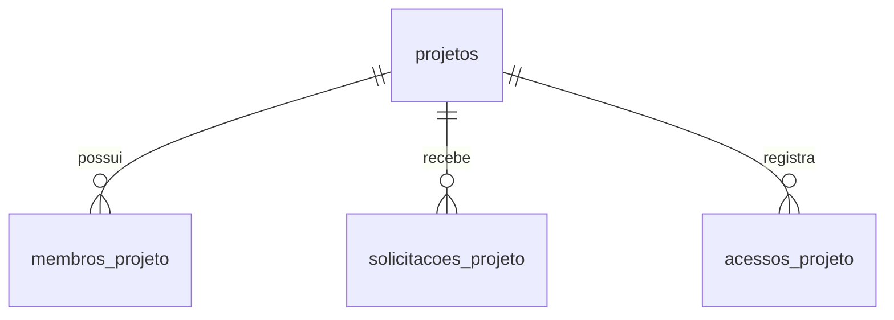

### 6.5 Fluxo de persistência
- Entrada HTTP -> Use Case -> Repository -> SQLAlchemy Model -> commit -> retorno como entidade.
- Conversões entidade/modelo são explícitas em `_para_entidade`.

### 6.6 Constraints e índices identificados
- `usuarios.email`: unique + index.
- PK indexadas por padrão.
- `acessos_empresa.empresa_id` e `acessos_empresa.usuario_id` com index.
- `acessos_projeto.projeto_id` e `acessos_projeto.usuario_id` com index.

### 6.7 Migrations
- Não há estrutura de migration versionada (Alembic/Flyway/Liquibase).
- Mudanças de schema leves são feitas no runtime (`_ensure_schema`).

---

## 7. APIs e Endpoints

Notas:
- URLs base locais padrão:
  - MS1: `http://localhost:8001`
  - MS2: `http://localhost:8002`
  - MS3: `http://localhost:8003`
- Auth: `Bearer JWT` quando indicado.

## 7.1 MS1 - Auth/Perfil (`docuia-auth`)

### Health

| Método | Rota | Auth | Descrição | Exemplo resposta |
|---|---|---|---|---|
| GET | `/` | Não | Health do serviço | `{"status":"ok","servico":"ms1_auth"}` |
| GET | `/health` | Não | Health do banco | `{"status":"ok","database":"connected","servico":"ms1_auth"}` |

### Autenticação

| Método | Rota | Auth | Body | Respostas | Exemplo request | Exemplo response |
|---|---|---|---|---|---|---|
| POST | `/auth/login` | Não | `{email, senha}` | 200, 401 | `{"email":"ana@x.com","senha":"123"}` | `{"token":"<jwt>","tipo":"bearer"}` |
| POST | `/auth/cadastro` | Não | `{nome,cargo,email,senha}` | 201, 400 | `{"nome":"Ana","cargo":"PM","email":"ana@x.com","senha":"123"}` | `{"mensagem":"Conta criada com sucesso","id":1}` |
| POST | `/auth/esqueceu-senha` | Não | `{email}` | 200 | `{"email":"ana@x.com"}` | `{"mensagem":"Instruções enviadas","token_recuperacao":"<jwt>"}` |
| POST | `/auth/redefinir-senha` | Não | `{token,nova_senha}` | 200, 400 | `{"token":"<jwt>","nova_senha":"Nova#123"}` | `{"mensagem":"Senha redefinida com sucesso"}` |

### Perfil

| Método | Rota | Auth | Body/Params | Respostas | Exemplo request | Exemplo response |
|---|---|---|---|---|---|---|
| GET | `/perfil/me` | Sim | - | 200, 401, 404 | Header `Authorization` | `{"id":1,"nome":"Ana","email":"ana@x.com","cargo":"PM"}` |
| POST | `/perfil/usuarios/batch` | Não* | `ids: list[int]` | 200 | `[1,2,3]` | `[{"id":1,"nome":"Ana","cargo":"PM"}]` |
| PUT | `/perfil/me` | Sim | `{nome,cargo}` | 200, 400, 401 | `{"nome":"Ana S.","cargo":"PO"}` | `{"mensagem":"Perfil atualizado","nome":"Ana S."}` |
| PUT | `/perfil/me/senha` | Sim | `{senha_atual,nova_senha}` | 200, 400, 401 | `{"senha_atual":"123","nova_senha":"Nova#123"}` | `{"mensagem":"Senha alterada com sucesso"}` |

\*Observação: `POST /perfil/usuarios/batch` não exige JWT no código atual.

## 7.2 MS2 - Empresas (`docuia-empresas`)

### Health

| Método | Rota | Auth | Descrição | Exemplo |
|---|---|---|---|---|
| GET | `/` | Não | Health do serviço | `{"status":"ok","servico":"ms2_empresas"}` |
| GET | `/health` | Não | Health do banco | `{"status":"ok","database":"connected","servico":"ms2_empresas"}` |

### Empresas

| Método | Rota | Auth | Body/Params | Respostas | Exemplo request | Exemplo response |
|---|---|---|---|---|---|---|
| GET | `/empresas` | Sim | - | 200, 401 | - | `[{"id":1,"nome":"Acme","descricao":"...","dono_id":1,"cor":"teal"}]` |
| GET | `/empresas/recentes?limit=6` | Sim | `limit` | 200 | - | `[{"id":1,"nome":"Acme","ultimo_acesso_em":"..."}]` |
| POST | `/empresas` | Sim | `{nome,descricao}` | 201, 401 | `{"nome":"Acme","descricao":"Empresa de testes"}` | `{"id":1,"nome":"Acme","cor":"teal"}` |
| GET | `/empresas/{empresa_id}` | Sim | path `empresa_id` | 200, 404 | - | `{"id":1,"nome":"Acme","descricao":"...","dono_id":1,"cor":"teal"}` |
| PUT | `/empresas/{empresa_id}` | Sim | `{nome,descricao}` | 200, 403 | `{"nome":"Acme 2","descricao":"Nova"}` | `{"id":1,"nome":"Acme 2","cor":"teal"}` |
| DELETE | `/empresas/{empresa_id}` | Sim | path | 204, 403 | - | sem body |
| POST | `/empresas/{empresa_id}/acessos` | Sim | path | 204 | - | sem body |

### Membros de empresa

| Método | Rota | Auth | Body/Params | Respostas | Exemplo request | Exemplo response |
|---|---|---|---|---|---|---|
| GET | `/empresas/{empresa_id}/membros` | Sim | path | 200 | - | `[{"id":1,"usuario_id":2,"role":"member"}]` |
| DELETE | `/empresas/{empresa_id}/membros/{usuario_id_alvo}` | Sim | path | 204, 403, 404 | - | sem body |
| PUT | `/empresas/{empresa_id}/membros/{usuario_id_alvo}/role` | Sim | `{role}` | 200, 403, 404 | `{"role":"admin"}` | `{"id":9,"usuario_id":2,"role":"admin"}` |
| DELETE | `/empresas/{empresa_id}/sair` | Sim | path | 204, 403, 404 | - | sem body |

### Solicitações de empresa

| Método | Rota | Auth | Body/Params | Respostas | Exemplo request | Exemplo response |
|---|---|---|---|---|---|---|
| GET | `/empresas/{empresa_id}/solicitacoes` | Sim | path | 200 | - | `[{"id":1,"usuario_id":4,"status":"pendente","mensagem":"..."}]` |
| POST | `/empresas/{empresa_id}/solicitacoes` | Sim | `{mensagem?}` | 201, 400 | `{"mensagem":"Quero participar"}` | `{"id":1,"status":"pendente"}` |
| PUT | `/empresas/{empresa_id}/solicitacoes/{solicitacao_id}` | Sim | `{acao}` | 200, 403 | `{"acao":"aprovada"}` | `{"id":1,"status":"aprovada"}` |

### Papéis de empresa

| Método | Rota | Auth | Body/Params | Respostas | Exemplo request | Exemplo response |
|---|---|---|---|---|---|---|
| GET | `/empresas/{empresa_id}/papeis` | Sim | path | 200 | - | `[{"id":1,"nome":"Owner","permissoes":"..."}]` |
| POST | `/empresas/{empresa_id}/papeis` | Sim | `{nome,descricao,permissoes}` | 201 | `{"nome":"Reviewer","descricao":"...","permissoes":"ver_projetos"}` | `{"id":8,"nome":"Reviewer","descricao":"...","permissoes":"ver_projetos"}` |
| PUT | `/empresas/{empresa_id}/papeis/{papel_id}` | Sim | `{nome,descricao,permissoes}` | 200, 404 | `{"nome":"Reviewer+","descricao":"...","permissoes":"..."}` | `{"id":8,"nome":"Reviewer+","descricao":"...","permissoes":"..."}` |
| DELETE | `/empresas/{empresa_id}/papeis/{papel_id}` | Sim | path | 204 | - | sem body |

## 7.3 MS3 - Projetos (`docuia-projetos`)

### Health

| Método | Rota | Auth | Descrição | Exemplo |
|---|---|---|---|---|
| GET | `/` | Não | Health do serviço | `{"status":"ok","servico":"ms3_projetos"}` |
| GET | `/health` | Não | Health do banco | `{"status":"ok","database":"connected","servico":"ms3_projetos"}` |

### Projetos

| Método | Rota | Auth | Body/Params | Respostas | Exemplo request | Exemplo response |
|---|---|---|---|---|---|---|
| GET | `/projetos` | Sim | - | 200 | - | `[{"id":1,"nome":"P1","empresa_id":1,"status":"ativo","cor":"teal"}]` |
| GET | `/projetos/recentes?limit=6` | Sim | `limit` | 200 | - | `[{"id":1,"nome":"P1","ultimo_acesso_em":"..."}]` |
| GET | `/projetos/empresa/{empresa_id}` | Sim | path | 200 | - | `[{"id":1,"nome":"P1","descricao":"...","status":"ativo"}]` |
| POST | `/projetos` | Sim | `{nome,descricao,empresa_id}` | 201 | `{"nome":"P1","descricao":"...", "empresa_id":1}` | `{"id":1,"nome":"P1","cor":"teal"}` |
| GET | `/projetos/{projeto_id}` | Sim | path | 200, 404 | - | `{"id":1,"nome":"P1","descricao":"...","empresa_id":1,"status":"ativo","cor":"teal"}` |
| PUT | `/projetos/{projeto_id}` | Sim | `{nome,descricao}` | 200, 403 | `{"nome":"P1 novo","descricao":"..."} ` | `{"id":1,"nome":"P1 novo","cor":"teal"}` |
| PUT | `/projetos/{projeto_id}/arquivar` | Sim | path | 200, 403 | - | `{"id":1,"status":"arquivado","cor":"teal"}` |
| PUT | `/projetos/{projeto_id}/desarquivar` | Sim | path | 200, 403 | - | `{"id":1,"status":"ativo","cor":"teal"}` |
| DELETE | `/projetos/{projeto_id}` | Sim | path | 204, 403 | - | sem body |
| POST | `/projetos/{projeto_id}/acessos` | Sim | path | 204 | - | sem body |
| DELETE | `/projetos/empresa/{empresa_id}/ocultar` | Sim | path | 204, 403 | - | sem body |

### Membros de projeto

| Método | Rota | Auth | Body/Params | Respostas | Exemplo request | Exemplo response |
|---|---|---|---|---|---|---|
| GET | `/projetos/{projeto_id}/membros` | Sim | path | 200 | - | `[{"id":1,"usuario_id":2,"role":"member"}]` |
| DELETE | `/projetos/{projeto_id}/sair` | Sim | path | 204, 403, 404 | - | sem body |

### Papéis e solicitações de projeto

| Método | Rota | Auth | Body/Params | Respostas | Exemplo request | Exemplo response |
|---|---|---|---|---|---|---|
| GET | `/projetos/{projeto_id}/papeis` | Sim | path | 200, 403, 404 | - | `[{"nome":"Owner","descricao":"...","permissoes":"..."}]` |
| GET | `/projetos/{projeto_id}/solicitacoes` | Sim | path | 200 | - | `[{"id":1,"usuario_id":4,"status":"pendente","mensagem":"..."}]` |
| POST | `/projetos/{projeto_id}/solicitacoes` | Sim | `{mensagem?}` | 201, 400 | `{"mensagem":"Posso entrar?"}` | `{"id":1,"status":"pendente"}` |
| PUT | `/projetos/{projeto_id}/solicitacoes/{solicitacao_id}` | Sim | `{acao}` | 200, 403 | `{"acao":"recusada"}` | `{"id":1,"status":"recusada"}` |

---

## 8. Interface Web (Frontend)

### 8.1 Rotas de páginas
- `/`, `/login`, `/cadastro`, `/esqueceu-senha`, `/confirmacao-senha`, `/criar-senha`
- `/dashboard`, `/perfil`
- `/empresas`, `/empresa`, `/empresa/membros`, `/empresa/solicitacoes`, `/empresa/configuracoes`
- `/projetos`, `/projeto`, `/projeto/membros`, `/projeto/solicitacoes`, `/projeto/configuracoes`

### 8.2 Arquivo de configuração dinâmica
- Endpoint: `GET /api-config.js`
- Injeta URLs dos serviços via ambiente:
  - `AUTH_API_URL`
  - `EMPRESAS_API_URL`
  - `PROJETOS_API_URL`
  - `UPLOAD_FRONTEND_URL`
  - `DIAGRAMAS_FRONTEND_URL`
  - `RELATORIOS_FRONTEND_URL`

### 8.3 Cliente HTTP (`static/js/api.js`)
- `authHeaders()` adiciona `Authorization` quando existe token.
- `handleResponse()` trata erros HTTP e 401.
- `getCurrentUser()` consulta `/perfil/me` e cacheia no navegador.

### 8.4 Guarda de autenticação (`static/js/auth-guard.js`)
- Redireciona para login quando rota é privada e não há token.

---

## 9. Fluxos do Sistema

## 9.1 Login

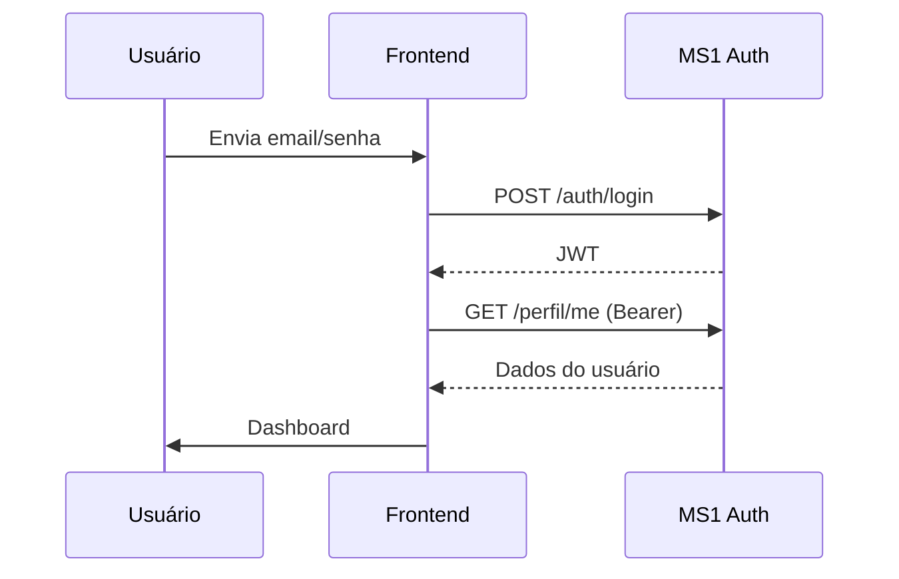

## 9.2 Cadastro

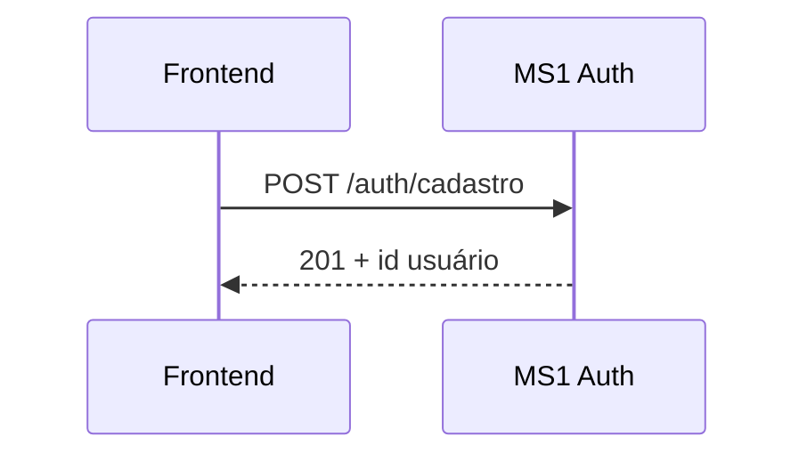

## 9.3 Criação de empresa

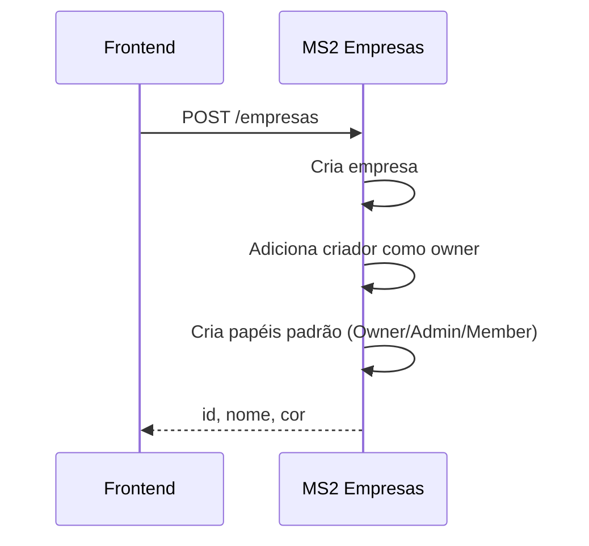

## 9.4 Solicitação e aprovação de acesso em empresa

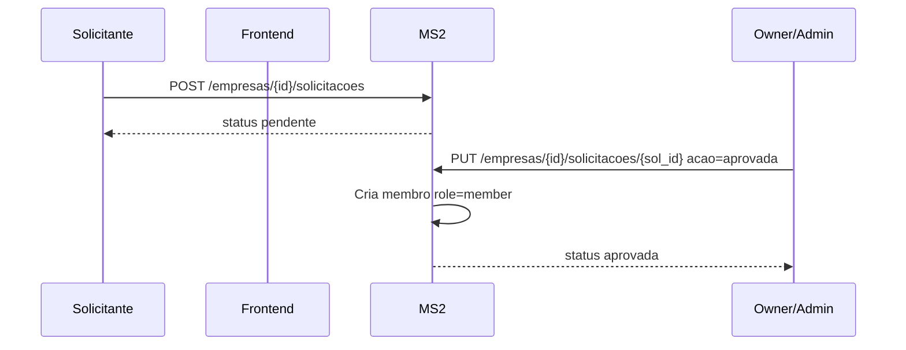

## 9.5 Criação de projeto

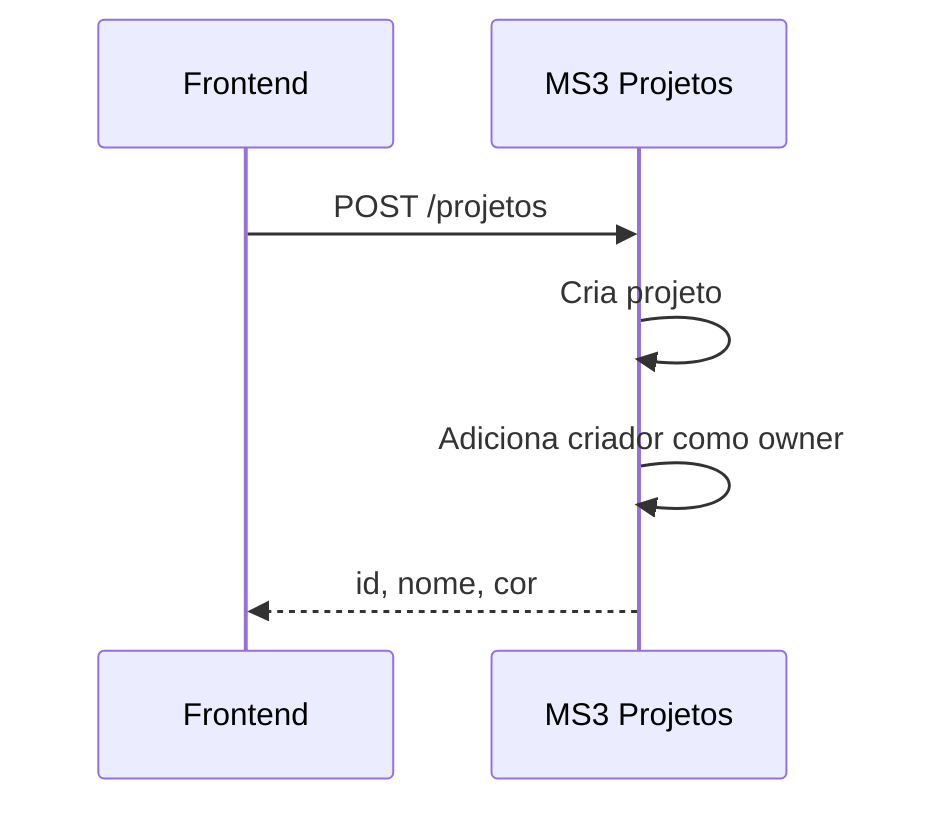

## 9.6 Exclusão de empresa e ocultação de projetos

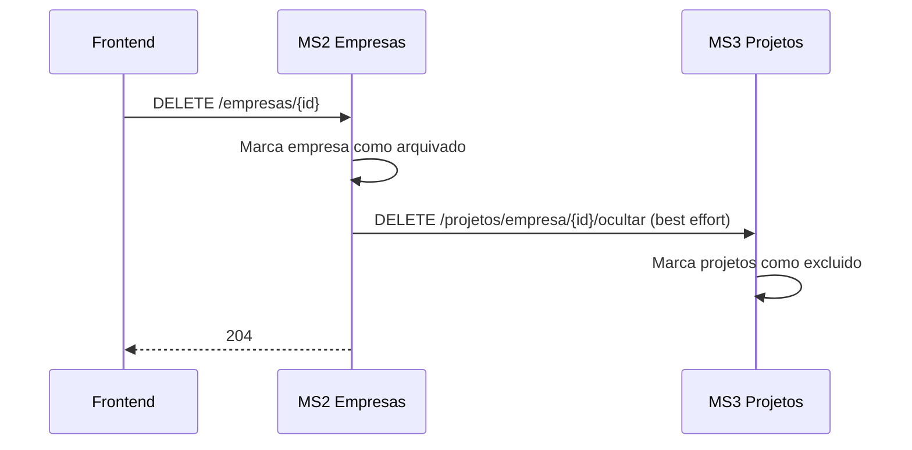

## 9.7 Dashboards e recentes
- Ao abrir páginas de empresa/projeto, frontend registra acesso (`/acessos`).
- Dashboard usa endpoints `.../recentes` para ordenar por último acesso.


---

## 10. Diagramas de Classes

### 10.1 MS1 - Auth

`mermaid
classDiagram
    class Usuario {
      +int? id
      +str nome
      +str email
      +str senha_hash
      +str cargo
      +datetime criado_em
      +tem_dados_completos() bool
    }

    class IUsuarioRepository {
      <<interface>>
      +salvar(usuario) Usuario
      +buscar_por_email(email) Usuario?
      +buscar_por_id(id) Usuario?
      +atualizar(usuario) Usuario
    }

    class UsuarioRepositoryImpl
    class LoginUseCase
    class CadastroUseCase
    class RecuperarSenhaUseCase
    class RedefinirSenhaUseCase
    class EditarPerfilUseCase
    class AlterarSenhaUseCase
    class AuthRouter
    class PerfilRouter

    IUsuarioRepository <|.. UsuarioRepositoryImpl
    LoginUseCase --> IUsuarioRepository
    CadastroUseCase --> IUsuarioRepository
    RecuperarSenhaUseCase --> IUsuarioRepository
    RedefinirSenhaUseCase --> IUsuarioRepository
    EditarPerfilUseCase --> IUsuarioRepository
    AlterarSenhaUseCase --> IUsuarioRepository
    AuthRouter --> LoginUseCase
    AuthRouter --> CadastroUseCase
    AuthRouter --> RecuperarSenhaUseCase
    AuthRouter --> RedefinirSenhaUseCase
    PerfilRouter --> EditarPerfilUseCase
    PerfilRouter --> AlterarSenhaUseCase
    UsuarioRepositoryImpl --> Usuario
`

### 10.2 MS2 - Empresas

`mermaid
classDiagram
    class Empresa
    class Membro
    class Solicitacao
    class Papel

    class IEmpresaRepository {<<interface>>}
    class IMembroRepository {<<interface>>}
    class ISolicitacaoRepository {<<interface>>}
    class IPapelRepository {<<interface>>}

    class EmpresaRepositoryImpl
    class MembroRepositoryImpl
    class SolicitacaoRepositoryImpl
    class PapelRepositoryImpl

    class CriarEmpresaUseCase
    class EditarEmpresaUseCase
    class DeletarEmpresaUseCase
    class SolicitarAcessoUseCase
    class GerenciarSolicitacaoUseCase
    class AlterarRoleMembroUseCase
    class SairEmpresaUseCase
    class EmpresaRouter

    IEmpresaRepository <|.. EmpresaRepositoryImpl
    IMembroRepository <|.. MembroRepositoryImpl
    ISolicitacaoRepository <|.. SolicitacaoRepositoryImpl
    IPapelRepository <|.. PapelRepositoryImpl

    CriarEmpresaUseCase --> IEmpresaRepository
    CriarEmpresaUseCase --> IMembroRepository
    CriarEmpresaUseCase --> IPapelRepository
    EditarEmpresaUseCase --> IEmpresaRepository
    EditarEmpresaUseCase --> IMembroRepository
    DeletarEmpresaUseCase --> IEmpresaRepository
    SolicitarAcessoUseCase --> ISolicitacaoRepository
    SolicitarAcessoUseCase --> IMembroRepository
    GerenciarSolicitacaoUseCase --> ISolicitacaoRepository
    GerenciarSolicitacaoUseCase --> IMembroRepository
    GerenciarSolicitacaoUseCase --> IEmpresaRepository
    AlterarRoleMembroUseCase --> IMembroRepository
    AlterarRoleMembroUseCase --> IEmpresaRepository
    SairEmpresaUseCase --> IMembroRepository
    SairEmpresaUseCase --> IEmpresaRepository
    EmpresaRouter --> CriarEmpresaUseCase
    EmpresaRouter --> EditarEmpresaUseCase
    EmpresaRouter --> DeletarEmpresaUseCase
`

### 10.3 MS3 - Projetos

`mermaid
classDiagram
    class Projeto
    class MembroProjeto
    class SolicitacaoProjeto

    class IProjetoRepository {<<interface>>}
    class IMembroProjetoRepository {<<interface>>}
    class ISolicitacaoProjetoRepository {<<interface>>}

    class ProjetoRepositoryImpl
    class MembroProjetoRepositoryImpl
    class SolicitacaoProjetoRepositoryImpl

    class CriarProjetoUseCase
    class EditarProjetoUseCase
    class ArquivarProjetoUseCase
    class DesarquivarProjetoUseCase
    class DeletarProjetoUseCase
    class SolicitarAcessoProjetoUseCase
    class GerenciarSolicitacaoProjetoUseCase
    class SairProjetoUseCase
    class OcultarProjetosPorEmpresaUseCase
    class ProjetoRouter

    IProjetoRepository <|.. ProjetoRepositoryImpl
    IMembroProjetoRepository <|.. MembroProjetoRepositoryImpl
    ISolicitacaoProjetoRepository <|.. SolicitacaoProjetoRepositoryImpl

    CriarProjetoUseCase --> IProjetoRepository
    CriarProjetoUseCase --> IMembroProjetoRepository
    EditarProjetoUseCase --> IProjetoRepository
    EditarProjetoUseCase --> IMembroProjetoRepository
    ArquivarProjetoUseCase --> IProjetoRepository
    ArquivarProjetoUseCase --> IMembroProjetoRepository
    DesarquivarProjetoUseCase --> IProjetoRepository
    DesarquivarProjetoUseCase --> IMembroProjetoRepository
    DeletarProjetoUseCase --> IProjetoRepository
    DeletarProjetoUseCase --> IMembroProjetoRepository
    SolicitarAcessoProjetoUseCase --> ISolicitacaoProjetoRepository
    SolicitarAcessoProjetoUseCase --> IMembroProjetoRepository
    GerenciarSolicitacaoProjetoUseCase --> ISolicitacaoProjetoRepository
    GerenciarSolicitacaoProjetoUseCase --> IMembroProjetoRepository
    SairProjetoUseCase --> IMembroProjetoRepository
    SairProjetoUseCase --> IProjetoRepository
    OcultarProjetosPorEmpresaUseCase --> IProjetoRepository
    OcultarProjetosPorEmpresaUseCase --> IMembroProjetoRepository
    ProjetoRouter --> CriarProjetoUseCase
    ProjetoRouter --> EditarProjetoUseCase
    ProjetoRouter --> DeletarProjetoUseCase
---

## 11. Instalação e Execução

### 11.1 Pré-requisitos
- Python 3.11+
- PostgreSQL

### 11.2 Variáveis de ambiente

#### Backends (`docuia-auth`, `docuia-empresas`, `docuia-projetos`)
- `DATABASE_URL`
- `JWT_SECRET`

#### Frontend (`docuia-frontend`)
- `AUTH_API_URL`
- `EMPRESAS_API_URL`
- `PROJETOS_API_URL`
- `UPLOAD_FRONTEND_URL`
- `DIAGRAMAS_FRONTEND_URL`
- `RELATORIOS_FRONTEND_URL`

### 11.3 Instalação manual (por serviço)
1. Entrar na pasta do serviço.
2. Criar ambiente virtual: `python -m venv .venv`
3. Ativar ambiente virtual.
4. Instalar dependências: `pip install -r requirements.txt`
5. Configurar `.env`.
6. Executar: `uvicorn main:app --host 127.0.0.1 --port <porta> --reload`

Portas padrão:
- `8001`: auth
- `8002`: empresas
- `8003`: projetos
- `5000`: frontend

### 11.4 Banco de dados local
- Criar 3 bancos PostgreSQL:
  - `ms1_db`
  - `ms2_db`
  - `ms3_db`
- Ajustar `DATABASE_URL` de cada serviço.
- Tabelas são criadas automaticamente com `create_all`.

### 11.5 Migrations
- Não há ferramenta de migration versionada.
- Ajustes pontuais de schema são feitos em runtime em `MS2` e `MS3` para coluna `mensagem`.

### 11.6 Build e deploy (produção)
- Deploy automático no Azure Web App via GitHub Actions em push para `main`.
- Um workflow por repositório (`.github/workflows/main_*.yml`).

### 11.7 Docker
- Não existe configuração Docker no estado atual do código.
- Para uso em Docker será necessário criar:
  - `Dockerfile` por serviço
  - `docker-compose.yml` com 4 apps + PostgreSQL

---

## 12. Repositórios Relacionados

| Repositório | Finalidade | Tecnologias | Relação com o sistema | Link |
|---|---|---|---|---|
| `docuia-auth` | Identidade, login, perfil | FastAPI, SQLAlchemy, PostgreSQL, JWT, passlib | Emite token consumido por frontend e demais MS | https://github.com/fenrir-mack/docuia-auth.git |
| `docuia-empresas` | Gestão de empresas, membros, papéis, solicitações | FastAPI, SQLAlchemy, PostgreSQL, JWT | Depende de token do MS1 e integra com MS3 para ocultação em cascata | https://github.com/fenrir-mack/docuia-empresas.git |
| `docuia-projetos` | Gestão de projetos, membros, solicitações | FastAPI, SQLAlchemy, PostgreSQL, JWT | Depende de token do MS1, vinculado a empresas do MS2 | https://github.com/fenrir-mack/docuia-projetos.git |
| `docuia-frontend` | Interface web e orquestração de chamadas API | FastAPI, Jinja2, JS | Consome MS1/MS2/MS3 e redireciona para serviços externos de upload/diagramas/relatórios | https://github.com/fenrir-mack/docuia-frontend.git |

---

## 13. Decisões Técnicas e Trade-offs

### Decisões encontradas
- Microserviços separados por domínio.
- Banco separado por microserviço.
- JWT stateless.
- Soft delete por `status`.
- Sem migrations formais; uso de `create_all` e patch de schema em runtime.
- Frontend sem framework SPA (SSR + JS vanilla).

### Trade-offs
- Vantagem: simplicidade de operação inicial.
- Risco: ausência de migrations versionadas dificulta evolução controlada de schema.
- Vantagem: baixo acoplamento entre serviços.
- Risco: consistência entre serviços depende de chamadas HTTP e regras de aplicação.

---

## 14. Problemas e Soluções

### 14.1 Problemas técnicos observados e soluções implementadas

1. Limite de senha com bcrypt no ambiente Azure
Solução: configuração de hash priorizando `pbkdf2_sha256` (com fallback `bcrypt`).

2. Evolução de schema sem migration tool
Solução: função `_ensure_schema()` em MS2/MS3 para garantir coluna `mensagem`.

3. Exclusão lógica com dependência entre domínios
Solução: ao excluir empresa, MS2 dispara ocultação de projetos no MS3 (best effort).

4. Risco de enumeração de email no "esqueci senha"・
Solução: resposta neutra quando email não existe.

### 14.2 Limitações atuais
- Sem suíte de testes automatizada no código analisado.
- Sem Docker oficial.
- Sem migration versionada.
- Endpoint `/perfil/usuarios/batch` sem autenticação explícita.
- Permissões e papéis modelados parcialmente como string CSV (difícil governança fina).

### 14.3 Otimizações já presentes
- Cache local de perfil do usuário no frontend.
- Endpoints de “recentes” com ordenação por último acesso.
- Deduplicação de IDs no batch de usuários.

---

## 15. Conclusão

### Resultados obtidos
- Ecossistema funcional de microserviços com autenticação, gestão de empresas/projetos e UI integrada.
- Estrutura em camadas bem definida nos backends.
- Pipeline de deploy contínuo já operacional para Azure.

### Objetivos alcançados (com base no código atual)
- Cadastro/login/perfil.
- Gestão de empresas, membros, solicitações e papéis.
- Gestão de projetos, membros e solicitações.
- Navegação web com dashboards e visão de acessos recentes.

### Limitações atuais
- Falta de padronização de migrations.
- Ausência de testes automatizados.
- Ausência de empacotamento por containers.
- Alguns pontos de segurança/autorização podem ser reforçados.

### Melhorias futuras recomendadas
1. Adotar Alembic com versionamento por serviço.
2. Criar testes unitários/integrados (use cases + APIs).
3. Introduzir Docker e compose para onboarding rápido.
4. Endurecer autorização em endpoints sensíveis (ex.: batch de usuários).
5. Evoluir controle de permissões para modelo estruturado (não CSV).
6. Adicionar observabilidade (logs estruturados, tracing, métricas).

---

## Apêndice A - Exemplo de chamadas HTTP

### Login
```bash
curl -X POST http://localhost:8001/auth/login \
  -H "Content-Type: application/json" \
  -d "{\"email\":\"ana@x.com\",\"senha\":\"123\"}"
```

### Criar empresa
```bash
curl -X POST http://localhost:8002/empresas \
  -H "Authorization: Bearer <token>" \
  -H "Content-Type: application/json" \
  -d "{\"nome\":\"Acme\",\"descricao\":\"Empresa de teste\"}"
```

### Criar projeto
```bash
curl -X POST http://localhost:8003/projetos \
  -H "Authorization: Bearer <token>" \
  -H "Content-Type: application/json" \
  -d "{\"nome\":\"Projeto 1\",\"descricao\":\"Piloto\",\"empresa_id\":1}"
```


